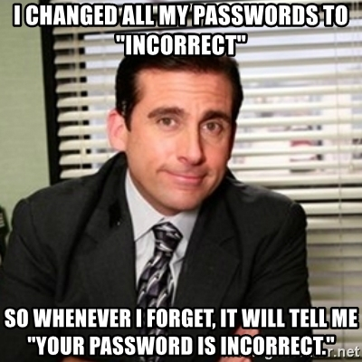

# Odd Security :lock:

[jacobburenstam.com/odd-security](http://jacobburenstam.com/odd-security)

---

# Agenda

- GDPR
- Security

---

## whoami

---

# GDPR :page_with_curl:

---

# FUD

Fear, Uncertainty and Doubt

---

+ Not __that__ big a change*
+ Defines some rules and rights

---

Don't answer any questions about GDPR refer to

+ oddmolly.com/gdpr
+ gdpr@oddmolly.com

---

+ Please refrain from sending personal data in email etc use URLs instead

---

John Doe, Stockholm
vs.
example.com/users/381726

---

# Security :lock:

---

## How many of you've heard of a
## hack the last year?

---

- Netflix, Facebook, Twitter, Uber, Dropbox, LinkedIN, MySpace, Runescape, Adobe, Apple, eBay, Equifax.....

<small>https://en.wikipedia.org/wiki/List_of_data_breaches</small>

---

Billions of hacked account details are public

---

# Passwords :lock:

---

---

## You probably know

- You're password is too weak
- That you reuse it, almost, everywhere

---

Please use a password manager

<small>Chrome, Safari or 1password/LastPassword</small>

---

correct horse battery staple

https://xkcd.com/936/

---

## Account sharing :raised_hand:

---

Create separate accounts for each user

---

# Email :mailbox_with_mail:

---

Think of email as regular mail

- anyone can send it in any name
- people on the way might read it

---

# Questions?

<small>Guide \| Empower \| Connect</small>

---

Guide \| Empower \| Connect
